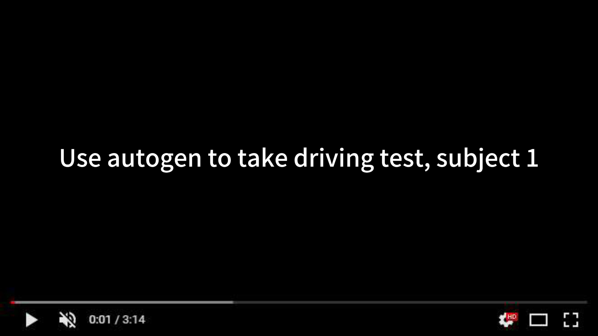

# Learn AutoGen

* Learn autogen step by step, multi agent design guide


[](https://youtu.be/RkgwIOEIoNw)


- [Learn AutoGen](#learn-autogen)
  - [Class Relationship](#class-relationship)
  - [Basic Definition](#basic-definition)
  - [Tools Definition](#tools-definition)
  - [ReAct Definition](#react-definition)
  - [Chats Group: initiate_chats](#chats-group-initiate_chats)
  - [More examples](#more-examples)
  - [Summarize single task](#summarize-single-task)
  - [Manual call tool and check chat history](#manual-call-tool-and-check-chat-history)
  - [Use class define a agent](#use-class-define-a-agent)
  - [Async run agent](#async-run-agent)
  - [Use other llm](#use-other-llm)
  - [More examples](#more-examples)

## Class Relationship

look full graph: [autogen_class_refs.pdf](./autogen_class_refs.pdf)


## Basic Definition
```python
from typing_extensions import Annotated
import autogen
import os
import sys
import subprocess

local_llm_config = {
    "config_list": [
        {
            "model": "gpt-4o",
            "api_key": os.environ.get("OPENAI_API_KEY"),
            "api_type": "open_ai",
        }
    ],
    "cache_seed": None,
}

## system_message is your task description:
chatbot = autogen.AssistantAgent(
    name="chatbot",
    system_message="""For (your task description) tasks,
        only use the functions you have been provided with.
        If the function has been called previously,
        return only the word 'TERMINATE'.""",
    llm_config=local_llm_config,
)

user_proxy = autogen.UserProxyAgent(
    name="user_proxy",
    is_termination_msg=lambda x: x.get("content", "")
    and "TERMINATE" in x.get("content", ""),
    human_input_mode="NEVER",
    max_consecutive_auto_reply=1,
    code_execution_config={"work_dir": "code", "use_docker": False},
)

## If you need define new tools, you can like this define:
@user_proxy.register_for_execution()
@chatbot.register_for_llm(description="Calculate distance between two addresses.")
def calculate_distance(
    start_address: Annotated[str, "Starting address"],
    end_address: Annotated[str, "Destination address"],
) -> str:
    .... (your function detail) ....

def main(question):
    res = user_proxy.initiate_chat(
        chatbot,
        message=question,
        summary_method="reflection_with_llm",
    )
    return res

question = sys.argv[1]
main(question)
```
## Tools Definition
```python
@user_proxy.register_for_execution()
@chatbot.register_for_llm(description="Calculate distance between two addresses.")
def calculate_distance(
    start_address: Annotated[str, "Starting address"],
    end_address: Annotated[str, "Destination address"],
) -> str:
      .... function detail ....

```
## ReAct Definition
```python
from autogen import AssistantAgent, UserProxyAgent, ConversableAgent
import os

assistant = AssistantAgent(
    name="assistant",
    llm_config={
        "config_list": [{"model": "gpt-4o", "api_key": os.environ.get("OPENAI_API_KEY")}]
    }
)

user_proxy = UserProxyAgent(
    name="user_proxy",
    human_input_mode="NEVER",
    max_consecutive_auto_reply=10,
    code_execution_config={"work_dir": "coding"}
)

task = "Analyze the following data and create a visualization: [Your data is  current path all log file]"

user_proxy.initiate_chat(
    assistant,
    message=task
)
```

## Chats Group: initiate_chats
```python
# Import the autogen package
import autogen

# Configure the large language model
llm_config = {
    "config_list": [{"model": "gpt-4-turbo", "api_key": os.environ['OPENAI_API_KEY']}],
}

# Define the tasks for running a flower e-commerce business
inventory_tasks = [
    """Check the current inventory of various flowers and report which ones are low in stock.""",
    """Based on the past month's sales data, predict which flowers will be in higher demand in the coming month.""",
]

market_research_tasks = ["""Analyze market trends to identify the most popular types of flowers and possible reasons for their popularity."""]

content_creation_tasks = ["""Using the provided information, write an engaging blog post about the most popular flowers and tips for selecting them."""]

# Create Agent roles
inventory_assistant = autogen.AssistantAgent(
    name="Inventory Management Assistant",
    llm_config=llm_config,
)
market_research_assistant = autogen.AssistantAgent(
    name="Market Research Assistant",
    llm_config=llm_config,
)
content_creator = autogen.AssistantAgent(
    name="Content Creation Assistant",
    llm_config=llm_config,
    system_message="""
        You are a professional writer known for insightful and engaging articles.
        You can transform complex concepts into compelling narratives.
        When everything is complete, please reply with 'TERMINATE'.
        """,
)

# Create User Proxy Agents
user_proxy_auto = autogen.UserProxyAgent(
    name="User Proxy_Auto",
    human_input_mode="NEVER",
    is_termination_msg=lambda x: x.get("content", "") and x.get("content", "").rstrip().endswith("TERMINATE"),
    code_execution_config={
        "last_n_messages": 1,
        "work_dir": "tasks",
        "use_docker": False,
    },
)

user_proxy = autogen.UserProxyAgent(
    name="User Proxy",
    human_input_mode="ALWAYS",
    is_termination_msg=lambda x: x.get("content", "") and x.get("content", "").rstrip().endswith("TERMINATE"),
    code_execution_config={
        "last_n_messages": 1,
        "work_dir": "tasks",
        "use_docker": False,
    },
)

# Initiate conversations
chat_results = autogen.initiate_chats(
    [
        {
            "sender": user_proxy_auto,
            "recipient": inventory_assistant,
            "message": inventory_tasks[0],
            "clear_history": True,
            "silent": False,
            "summary_method": "last_msg",
        },
        {
            "sender": user_proxy_auto,
            "recipient": market_research_assistant,
            "message": market_research_tasks[0],
            "max_turns": 2,
            "summary_method": "reflection_with_llm",
        },
        {
            "sender": user_proxy,
            "recipient": content_creator,
            "message": content_creation_tasks[0],
            "carryover": "I would like to include a data table or chart in the blog post.",
        },
    ]
)
```

## Summarize single task

```python
import os
import autogen

config_list = [
    {
        "model": "gpt-4o",
        "api_key": os.environ.get("OPENAI_API_KEY"),
        "api_type": "open_ai",
    }
]


llm_config = {
    "seed": 42,
    "config_list": config_list,
    "temperature": 0
}

assistant = autogen.AssistantAgent(
    name="assistant",
    llm_config=llm_config
)

user_proxy = autogen.UserProxyAgent(
    name="user_proxy",
    human_input_mode="TERMINATE",
    max_consecutive_auto_reply=10,
    is_termination_msg=lambda x: x.get("content", "") and x.get("content", "").rstrip().endswith("TERMINATE"),
    code_execution_config={"work_dir": "web"},
    llm_config=llm_config,
    system_message="""Reply TERMINATE if the task has been solved at full satisfaction
    Otherwise, reply CONTINUE, or the reason why the task is not solved yet."""
)

task = """
I Give me a summary of this article: https://apnews.com/article/school-shootings-talk-with-kids-cd21c1445cb6cfd89ed9184f030530ff
"""

user_proxy.initiate_chat(
    assistant,
    message=task
)
```

## Use class define a agent

```python
class CodeSummarizerAgent(AssistantAgent):
    def __init__(self, name):
        super().__init__(name=name)
        self.system_prompt = "You are a code summarizer. Summarize the given code and test results."

    def summarize(self, code, test_results):
        prompt = f"Summarize the following code and test results:\n\nCode:\n{code}\n\nTest Results:\n{test_results}"
        response = self.chat(prompt)
        summary = response.content
        return summary

code_summarizer = CodeSummarizerAgent(name="CodeSummarizer")
summary = code_summarizer.summarize(code, test_results)

```

## Manual call tool and check chat history

```python
def main(question):
    chat_history = []
    while True:
        print(f"Sending message to chatbot: {question}")
        response = user_proxy.initiate_chat(
            chatbot,
            message=question,
            clear_history=False
        )

        print(f"Received response: {response}")

        if response.chat_history:
            last_message = response.chat_history[-1]
            chat_history.append(last_message)
            print(f"Last message: {last_message}")

            if last_message.get('tool_calls'):
                print("Function call detected, executing...")
                tool_call = last_message['tool_calls'][0]
                function_name = tool_call['function']['name']
                function_args = tool_call['function']['arguments']
                print(f"Function to call: {function_name}")
                print(f"Function arguments: {function_args}")

                # Execute the function
                if function_name == 'get_screen_question':
                    result = get_screen_question()
                elif function_name == 'select_answer':
                    import json
                    args = json.loads(function_args)
                    result = select_answer(args['answer'])
                else:
                    result = "Unknown function"

                # Prepare the tool response message
                tool_response = {
                    "tool_call_id": tool_call['id'],
                    "role": "tool",
                    "name": function_name,
                    "content": result
                }

                # Send the tool response back to the chatbot
                question = f"Tool response: {json.dumps(tool_response)}"
            else:
                print("No function call detected, terminating...")
                break
        else:
            print("No messages in the response, terminating...")
            break

    return chat_history
```

## Async run agent

```python
import asyncio
from autogen_agentchat.agents import AssistantAgent
from autogen_agentchat.task import Console, TextMentionTermination
from autogen_agentchat.teams import RoundRobinGroupChat
from autogen_ext.models import OpenAIChatCompletionClient

# Define a tool
async def get_weather(city: str) -> str:
    return f"The weather in {city} is 73 degrees and Sunny."

async def main() -> None:
    # Define an agent
    weather_agent = AssistantAgent(
        name="weather_agent",
        model_client=OpenAIChatCompletionClient(
            model="gpt-4o-2024-08-06",
            # api_key="YOUR_API_KEY",
        ),
        tools=[get_weather],
    )

    # Define termination condition
    termination = TextMentionTermination("TERMINATE")

    # Define a team
    agent_team = RoundRobinGroupChat([weather_agent], termination_condition=termination)

    # Run the team and stream messages to the console
    stream = agent_team.run_stream(task="What is the weather in New York?")
    await Console(stream)

asyncio.run(main())
```
  
## Use other llm

```python
# OpenRouter API configuration
OPENROUTER_API_KEY = os.environ['OPENROUTER_API_KEY']

class OpenRouterLLM:
    def __init__(self, model="openai/gpt-4o-2024-08-06"):
        self.model = model

    def create_completion(self, messages):
        response = requests.post(
            url="https://openrouter.ai/api/v1/chat/completions",
            headers={
                "Authorization": f"Bearer {OPENROUTER_API_KEY}"
            },
            data=json.dumps({
                "model": self.model,
                "messages": messages,
                "max_tokens": 4000,
                "temperature": 0.7,
            })
        )
        return response.json()

llm = OpenRouterLLM()

# ---- 
class CustomAssistantAgent(autogen.AssistantAgent):
    def generate_reply(self, sender=None, messages=None):
        if messages is None:
            messages = self._oai_messages

        if not messages:
            return None

        system_message = self.system_message

        last_message = messages[-1]
        if isinstance(last_message, dict):
            last_message_content = last_message.get('content', '')
        else:
            last_message_content = str(last_message)

        api_messages = create_messages(system_message, last_message_content)
        response = llm.create_completion(api_messages)

        try:
            reply = response['choices'][0]['message']['content']
            if self.name == "narrative_writer":
                novel_progress.add_content(reply)
            return reply
        except KeyError:
            return "I apologize, but I encountered an error processing your request."

story_planner = CustomAssistantAgent(
    name="story_planner",
    system_message=story_planner_config["system_message"]
)

```

## More examples

* https://github.com/xlisp/novelist-agent
* https://github.com/xlisp/learn-autogen/tree/master/autogen_examples
* https://github.com/xlisp/learn-autogen/tree/master/jiaxiao_pyautogui_app

