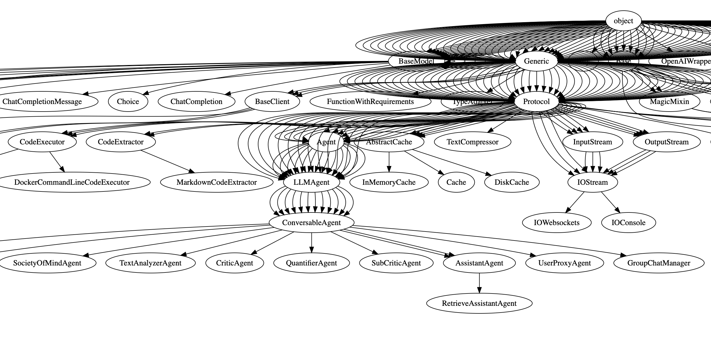

# Learn AutoGen

- [Learn AutoGen](#learn-autogen)
  - [Class Relationship](#class-relationship)
  - [Basic Definition](#basic-definition)
  - [Tools Definition](#tools-definition)
  - [ReAct Definition](#react-definition)
  - [Chats Group: initiate_chats](#chats-group-initiate_chats)
  - [More examples](#more-examples)


## Class Relationship

look full graph: [autogen_class_refs.pdf](./autogen_class_refs.pdf)



## Basic Definition
```python
from typing_extensions import Annotated
import autogen
import os
import sys
import subprocess

local_llm_config = {
    "config_list": [
        {
            "model": "gpt-4o",
            "api_key": os.environ.get("OPENAI_API_KEY"),
            "api_type": "open_ai",
        }
    ],
    "cache_seed": None,
}

## system_message is your task description: 
chatbot = autogen.AssistantAgent(
    name="chatbot",
    system_message="""For (your task description) tasks,
        only use the functions you have been provided with.
        If the function has been called previously,
        return only the word 'TERMINATE'.""",
    llm_config=local_llm_config,
)

user_proxy = autogen.UserProxyAgent(
    name="user_proxy",
    is_termination_msg=lambda x: x.get("content", "")
    and "TERMINATE" in x.get("content", ""),
    human_input_mode="NEVER",
    max_consecutive_auto_reply=1,
    code_execution_config={"work_dir": "code", "use_docker": False},
)

## If you need define new tools, you can like this define:
@user_proxy.register_for_execution()
@chatbot.register_for_llm(description="Calculate distance between two addresses.")
def calculate_distance(
    start_address: Annotated[str, "Starting address"],
    end_address: Annotated[str, "Destination address"],
) -> str:
    .... (your function detail) ....

def main(question):
    res = user_proxy.initiate_chat(
        chatbot,
        message=question,
        summary_method="reflection_with_llm",
    )
    return res

question = sys.argv[1]
main(question)
```
## Tools Definition
```python
function_map not effect, you must use this way , like this:
'''python
@user_proxy.register_for_execution()
@chatbot.register_for_llm(description="Calculate distance between two addresses.")
def calculate_distance(
    start_address: Annotated[str, "Starting address"],
    end_address: Annotated[str, "Destination address"],
) -> str:
      .... function detail ....
'''
```
## ReAct Definition
```python
from autogen import AssistantAgent, UserProxyAgent, ConversableAgent
import os

assistant = AssistantAgent(
    name="assistant",
    llm_config={
        "config_list": [{"model": "gpt-4o", "api_key": os.environ.get("OPENAI_API_KEY")}]
    }
)

user_proxy = UserProxyAgent(
    name="user_proxy",
    human_input_mode="NEVER",
    max_consecutive_auto_reply=10,
    code_execution_config={"work_dir": "coding"}
)

task = "Analyze the following data and create a visualization: [Your data is  current path all log file]"

user_proxy.initiate_chat(
    assistant,
    message=task
)
```

## Chats Group: initiate_chats
```python
# Import the autogen package
import autogen

# Configure the large language model
llm_config = {
    "config_list": [{"model": "gpt-4-turbo", "api_key": os.environ['OPENAI_API_KEY']}],
}

# Define the tasks for running a flower e-commerce business
inventory_tasks = [
    """Check the current inventory of various flowers and report which ones are low in stock.""",
    """Based on the past month's sales data, predict which flowers will be in higher demand in the coming month.""",
]

market_research_tasks = ["""Analyze market trends to identify the most popular types of flowers and possible reasons for their popularity."""]

content_creation_tasks = ["""Using the provided information, write an engaging blog post about the most popular flowers and tips for selecting them."""]

# Create Agent roles
inventory_assistant = autogen.AssistantAgent(
    name="Inventory Management Assistant",
    llm_config=llm_config,
)
market_research_assistant = autogen.AssistantAgent(
    name="Market Research Assistant",
    llm_config=llm_config,
)
content_creator = autogen.AssistantAgent(
    name="Content Creation Assistant",
    llm_config=llm_config,
    system_message="""
        You are a professional writer known for insightful and engaging articles.
        You can transform complex concepts into compelling narratives.
        When everything is complete, please reply with 'TERMINATE'.
        """,
)

# Create User Proxy Agents
user_proxy_auto = autogen.UserProxyAgent(
    name="User Proxy_Auto",
    human_input_mode="NEVER",
    is_termination_msg=lambda x: x.get("content", "") and x.get("content", "").rstrip().endswith("TERMINATE"),
    code_execution_config={
        "last_n_messages": 1,
        "work_dir": "tasks",
        "use_docker": False,
    },
)

user_proxy = autogen.UserProxyAgent(
    name="User Proxy",
    human_input_mode="ALWAYS",
    is_termination_msg=lambda x: x.get("content", "") and x.get("content", "").rstrip().endswith("TERMINATE"),
    code_execution_config={
        "last_n_messages": 1,
        "work_dir": "tasks",
        "use_docker": False,
    },
)

# Initiate conversations
chat_results = autogen.initiate_chats(
    [
        {
            "sender": user_proxy_auto,
            "recipient": inventory_assistant,
            "message": inventory_tasks[0],
            "clear_history": True,
            "silent": False,
            "summary_method": "last_msg",
        },
        {
            "sender": user_proxy_auto,
            "recipient": market_research_assistant,
            "message": market_research_tasks[0],
            "max_turns": 2,
            "summary_method": "reflection_with_llm",
        },
        {
            "sender": user_proxy,
            "recipient": content_creator,
            "message": content_creation_tasks[0],
            "carryover": "I would like to include a data table or chart in the blog post.",
        },
    ]
)
```

## More examples

https://github.com/chanshunli/learn-autogen/tree/main/autogen_examples

